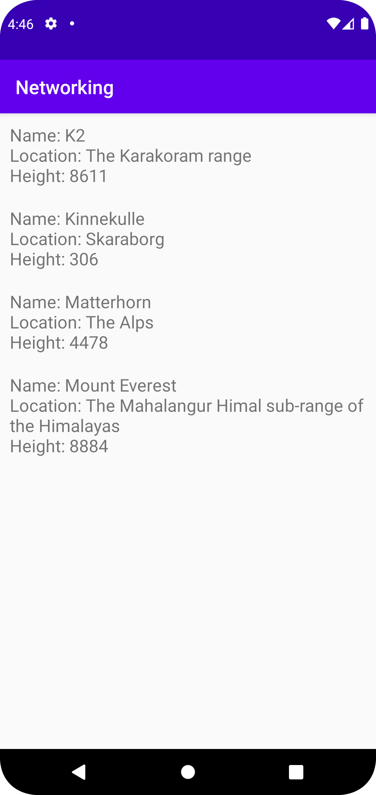

# Rapport

Först läggs en RecycleView in i activity_main.xml, efter det 
sätts alla constraints och dependencies läggs in i build.gradle:

    implementation 'androidx.recyclerview:recyclerview:1.2.1'

Sedan skapas classen Mountain med tre privata fält för att lagra data:

    private String name;
    private String location;
    @SerializedName("size")
    private int height;

Nu behövs en ny xml fil för som representerar hur ett mountain 
visas i RecycleView, mountain_item.xml skapas i layout mappen, här används
LinearLayout och TextView med en del designelement som padding och textsize.

Sedan skapas RecyclerViewAdapter classen vilket används för att visa data i 
våran RecycleView. Här används Mountain classen som returnar en String som 
beskriver ett berg och mountain_item.xml för att visa varje berg.

Sedan lägger vi till adaptern i MainActivity.java:

    private RecyclerViewAdapter adapter;
    private ArrayList<Mountain> items;

I onCreate:

    adapter = new RecyclerViewAdapter(this, items, new RecyclerViewAdapter.OnClickListener() {
        @Override
        public void onClick(Mountain item) {
            Toast.makeText(MainActivity.this, item.getMountain(), Toast.LENGTH_SHORT).show();
        }
    });
    RecyclerView view = findViewById(R.id.displayMountains);
    view.setLayoutManager(new LinearLayoutManager(this));
    view.setAdapter(adapter);
    
JSON data hämtas från URLen "https://mobprog.webug.se/json-api?login=brom" och sparas
i items, som är en array av typen Mountain:

    @Override
    public void onPostExecute(String json) {
        Log.d("MainActivity", json);
        Type type = new TypeToken<List<Mountain>>() {
        }.getType();
        items = gson.fromJson(json, type);

        adapter.setItems(items);
        adapter.notifyDataSetChanged();
    }

Efter att internetaccess lagts till kan appen komma åt datan och appen ser ut som sådan:

